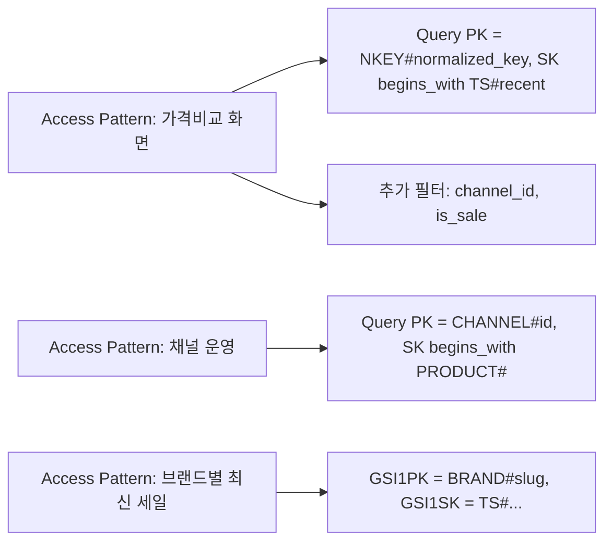
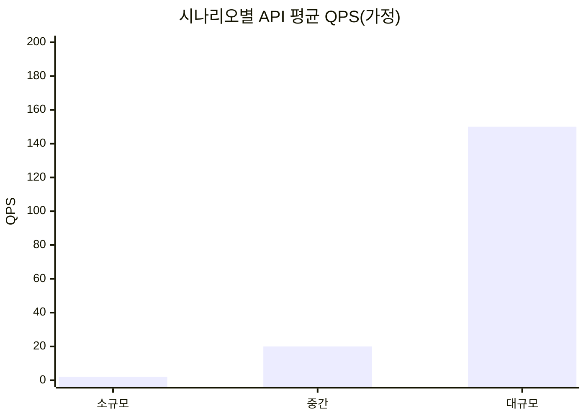
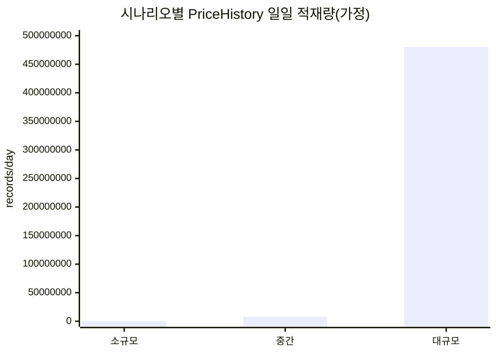
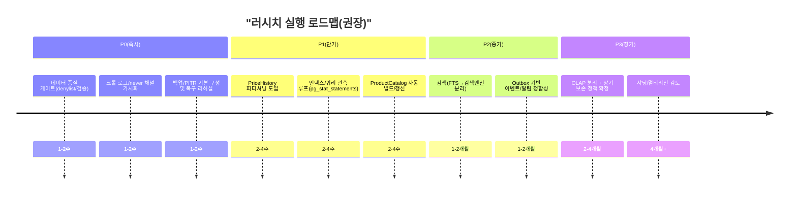

# 러시치 프로젝트 리서치 및 데이터베이스 구조 우수 사례 보고서

> 작성일: 2026-03-01 (Asia/Seoul)  
> 제약 및 가정: 사용자 추가 요구사항이 제공되지 않았으므로, 대상 사용자·정확한 트래픽·데이터 보존 정책 등은 **미지정**으로 표기하며, 본문에 **가정 시나리오(소규모/중간/대규모)**를 명시합니다.

## Executive summary

‘러시치’ 프로젝트의 상세 정의가 별도로 제공되지 않았습니다. 다만, 제공된 내부 문서에서 동일/유사 프로젝트가 **패션 판매채널(Shopify/Cafe24 기반 편집샵·브랜드스토어 등)의 제품·가격 데이터를 수집하여 동일 제품의 채널별 가격 비교 및 구매 타이밍 분석을 제공**하는 시스템(문서상 명칭: Fashion Data Engine)으로 설명되어 있어, 본 보고서는 이를 ‘러시치’로 **가정**하고 리서치·권장안을 도출했습니다. fileciteturn0file1

핵심 권장 방향은 “**PostgreSQL 중심의 정규화된 OLTP 스키마 + 대용량 시계열(PriceHistory) 처리 최적화(파티셔닝/인덱싱/아카이빙) + 크롤링/매칭 품질을 위한 데이터 품질 게이트(denylist·신뢰도·감사) + 운영 자동화(백업/PITR/모니터링/마이그레이션 규율)**”로 요약됩니다. PostgreSQL은 파티셔닝(범위/리스트/해시)과 다양한 인덱스 타입(B-tree, GIN 등), 트랜잭션 격리 수준, 쿼리 통계(예: pg_stat_statements) 등의 메커니즘이 공식 문서로 잘 정리되어 있어, 해당 유형(수집·집계·검색·시계열·알림) 워크로드에서 실무 적용성이 높습니다. citeturn0search0turn7search0turn7search1turn7search3

또한, 유사 서비스(국내: 가격비교/쇼핑 카탈로그, 해외: 가격 추적/패션 검색)는 공통적으로 (1) 상품 식별/매칭(카탈로그), (2) 가격/재고 시계열 저장, (3) 알림(가격 하락 등), (4) 수집 파이프라인(크롤링·피드·API), (5) 검색·필터 성능을 핵심 역량으로 둡니다. 특히 대형 플랫폼은 대용량 ETL 및 실시간/배치 파이프라인을 강조합니다. citeturn5view0turn3search2turn2search0turn2search8

---

## 프로젝트 개요와 요구사항

### 프로젝트 개요

- 목적: **여러 패션 판매채널**의 제품 및 가격을 수집하고, **동일 제품의 채널별 가격 비교** 및 **가격 변동/세일 감지**를 통해 구매 의사결정을 지원 (가정: 내부 문서 기반). fileciteturn0file1  
- 주요 기능(관찰/추정):
  - 채널(판매처) 메타데이터 관리 및 크롤 대상 활성화/비활성화
  - 제품 수집(예: Shopify JSON 엔드포인트/HTML 파싱) 및 가격 이력 적재
  - 교차채널 동일 제품 매칭 키(예: product_key/normalized_key) 생성 및 신뢰도 관리 fileciteturn0file1
  - 가격 하락/세일 시작/신제품 등의 이벤트 감지 후 알림(예: Discord) fileciteturn0file1
  - 데이터 품질 이슈 대응(예: 배송 보험/보호 상품이 일반 상품으로 오인식되는 문제) fileciteturn0file0
- 대상 사용자: **미지정**  
  - (실무적 분류 예시) 일반 소비자/패션 마니아, 리셀러·바이어, 내부 운영자(채널/품질 관리), 제휴사(데이터 API) 등은 가능하나, 확정 정보가 없으므로 미지정으로 유지합니다.

### 요구사항 수집

아래는 “미지정 항목은 미지정으로 표기” 원칙을 유지하면서, 내부 문서로 확인 가능한 항목과 실무적 필수 요구사항을 분리해 정리한 결과입니다.

**기능적 요구사항(Functional Requirements)**  
- 채널 관리
  - 채널 등록/수정/비활성화(크롤 제외), 채널 유형/국가/플랫폼 감지(Shopify/Cafe24/기타) fileciteturn0file1
- 수집(크롤링/ETL)
  - 채널별 제품/가격 수집(배치) 및 실패/지연(429/503 등) 처리, 재시도/레이트리밋 준수(미지정: 세부 정책) fileciteturn0file1
- 제품 매칭(카탈로그)
  - 교차채널 동일 제품을 식별할 키 생성 및 보정(정규화 키, 신뢰도) fileciteturn0file1
- 가격 이력 및 분석
  - 가격 이력 저장(시계열), 세일 플래그/할인율 계산(미지정: 기준 로직) fileciteturn0file1
- 알림/관심 대상
  - 관심 목록 기반 알림 필터링(미지정: 채널/브랜드/제품 키 단위) fileciteturn0file1
- 운영/감사
  - 채널별 크롤 성공/실패/미시도(never) 추적 및 운영 메모, 데이터 품질 감사 리포트 fileciteturn0file0turn0file1

**비기능적 요구사항(Non-Functional Requirements)**  
- 가용성: **미지정** (실무 권장: API 99.9% 목표, 크롤러는 배치 SLA 분리)
- 확장성: **미지정** (단, PriceHistory는 시계열로 빠르게 증가하는 구조이므로 확장 설계가 사실상 필수)
- 성능:
  - 검색/가격비교 API의 p95 지연시간 목표: **미지정**
  - 크롤 처리량(채널/제품 수 대비 시간): **미지정**
- 데이터 보존/거버넌스: **미지정** (실무 권장: 가격 이력 보존기간/압축/아카이빙 정책을 초기부터 문서화)
- 보안/컴플라이언스:
  - 개인정보 범위: **미지정** (구매이력/관심목록이 사용자 단위로 확장될 경우 RLS/테넌시/암호화 고려 필요) fileciteturn0file1
- 관측가능성(Observability): **미지정** (실무 권장: DB/크롤/API 모두 지표/로그/트레이싱)

---

## 유사 프로젝트 사례 분석

공개 자료를 기반으로 “기능·데이터 구조·운영 관점에서 러시치와 비교 가능한 시스템”을 선정했습니다. 일부는 내부 아키텍처의 세부가 공개되지 않으므로, **공개 사실**과 **일반적으로 요구되는 참조 아키텍처**를 분리해 서술합니다.

### 사례 비교 요약(표)

| 사례 | 범주 | 핵심 기능(공개) | 공개된/추정 아키텍처 포인트 | 러시치에 주는 시사점 |
|---|---|---|---|---|
| **entity["organization","CamelCamelCamel","amazon price tracker"]** | 해외(가격 추적) | Amazon 가격 추적/알림 제공 | “가격 이력 저장 + 사용자 임계치 기반 알림”이 핵심(공개) citeturn2search8turn2search9 | PriceHistory 모델의 장기 보존/조회 성능, alert rule 평가(대량) 설계 중요 |
| **entity["organization","Keepa","price tracker service"]** | 해외(가격 추적) | 가격 히스토리 차트, 가격 하락 알림, 대규모 추적(공개) | “수십억 단위 상품 추적” 강조(공개) citeturn2search0turn3search3 | 대규모 시계열 저장(파티셔닝/압축/아카이빙), API 응답용 집계 테이블 필요 |
| **entity["company","Danawa","korean price comparison"]** | 국내(가격비교) | 가격비교 중심 쇼핑 정보 제공(공개) | 통합 검색·옵션별 정보 제공(공개) citeturn2search3turn2search1 | “카탈로그(동일상품 매칭) + 옵션(variant) 정규화”가 제품 경험 좌우 |
| **entity["company","NAVER","korean internet company"]** 쇼핑/가격비교(네이버 가격비교) | 국내(카탈로그/검색) | 상품 검색·카테고리 분류·가격비교(공개) | 대용량 ETL/파이프라인 고도화 강조(공개 자료) citeturn3search2turn5view0turn2search14 | 매칭/분류 품질(ML 포함)·데이터 파이프라인 운영 성숙도가 경쟁력 |
| **entity["company","Lyst","fashion search platform"]** | 해외(패션 검색/집계) | 다수 브랜드·리테일러 상품 탐색·비교(공개) | 마이크로서비스, AWS ECS, 모니터링 도구 사용(공개 블로그) citeturn3search0turn3search5 | 크롤/카탈로그/검색/알림을 서비스 경계로 분리하고 관측가능성 표준화 필요 |

위 표의 “공개” 항목은 각 서비스/문서의 공식 안내 또는 기업/기술 블로그에서 확인 가능한 범위로 제한했습니다. citeturn2search0turn2search8turn2search3turn3search2turn3search0turn3search5

### 사례별 분석(개요·아키텍처·데이터 흐름·장단점)

**CamelCamelCamel**
- 개요: Amazon 상품의 가격 변동을 추적하고, 사용자가 지정한 조건(임계 가격 등)에 따라 알림을 제공하는 가격 추적 서비스로 소개됩니다. citeturn2search8turn2search9
- 아키텍처(참조): 대량의 (상품, 시점, 가격) 관측치를 저장하는 시계열 테이블 + 알림 룰(사용자×상품) 평가 + 통지(메일/푸시 등) 파이프라인이 핵심입니다(세부 구현은 비공개, 기능 요구로부터 추정).
- 데이터 흐름: 수집(가격 관측) → 시계열 적재 → 변화 감지(전일 대비/임계치 교차) → 알림 발송.
- 장점: 시계열/알림 모델이 단순하며 사용자 가치가 명확.
- 단점: 알림 룰이 커질수록 “룰 평가 비용”이 커지며, 수집 대상의 스키마 변화/차단에 취약(일반적 크롤/추적 서비스의 한계).

**Keepa**
- 개요: “수십억 단위 Amazon 상품을 추적하고 가격 히스토리 차트와 가격 하락 알림을 제공”한다고 명시합니다. citeturn2search0turn3search3
- 아키텍처(참조): 고압축 시계열 저장(가격/랭킹/오퍼 등), 캐시/프리컴퓨트(최근 구간·최저가), 외부 API 제공(유료/파트너) 등의 구성이 강하게 요구됩니다(규모 주장에 기반한 추정).
- 데이터 흐름: 대량 관측치 축적 → 히스토리 API/차트 렌더링 → 유의미 이벤트(가격 하락 등) 알림.
- 장점: “장기 이력”과 “빠른 조회”를 동시에 제공하는 데이터 모델/압축 전략이 경쟁력.
- 단점: 장기 이력 저장 비용 및 적재/정합성 관리(백필·누락)가 운영 리스크.

**Danawa**
- 개요: 가격비교 중심으로 양질의 쇼핑정보를 제공하며, 통합 검색/상세 정보/옵션별 검색 등을 제공한다고 소개합니다. citeturn2search3turn2search1
- 아키텍처(참조): (1) 판매처/상품 데이터 수집(피드·API·크롤), (2) 동일 상품 카탈로그 매칭, (3) 옵션/스펙 정규화, (4) 검색/필터, (5) 가격비교 화면용 집계(최저가·배송비 포함 등)로 분리하는 형태가 일반적입니다(세부 비공개, 서비스 기능의 일반적 구현 패턴).
- 데이터 흐름: 판매처 상품/가격 수집 → 동일상품 매칭(카탈로그) → 가격비교 노출.
- 장점: 카탈로그 품질과 옵션 모델링이 서비스 품질을 좌우(러시치의 normalized_key와 동일한 본질).
- 단점: 판매처 데이터 품질 편차로 인한 매칭 오차/중복/누락 관리 비용이 큼.

**NAVER 쇼핑(가격비교/카탈로그)**
- 개요: 네이버 가격비교는 상품 검색·카테고리 분류·가격비교 등 쇼핑포털 기능을 제공한다고 안내합니다. citeturn3search2
- 아키텍처(공개 범위): 네이버 쇼핑의 “쇼핑 Aggregation/검색 플랫폼”은 카탈로그를 통한 가격비교와 검색 최적화를 다루며, 대량 데이터를 빠르고 정확하게 처리 가능한 ETL 플랫폼 구축과 최신 AI 적용을 강조하는 공개 자료(채용/조직 소개)가 있습니다. citeturn5view0turn2search14
- 데이터 흐름(참조): 대규모 상품 데이터 입수 → 정제/분류 → 카탈로그(동일상품 묶음) → 검색/가격비교.
- 장점: 분류/매칭(ML 포함)과 파이프라인 운영이 핵심 역량.
- 단점: 러시치가 대형 플랫폼 수준의 실시간 파이프라인으로 갈수록, 데이터·모델·운영 복잡도와 비용이 급증.

**Lyst**
- 개요: 다수 브랜드/리테일러의 상품을 한 곳에서 탐색·비교하는 패션 검색 플랫폼으로 안내합니다. citeturn3search0
- 아키텍처(공개): 마이크로서비스로 전환(20개+ 서비스), AWS ECS 기반 운영, New Relic/Sentry/Grafana 등을 모니터링에 사용했다고 기술 블로그에서 밝힙니다. citeturn3search5
- 데이터 흐름(참조): 리테일러/브랜드 상품 집계 → 제품 카탈로그/검색 인덱스 → 사용자 탐색/필터 → (리디렉션/체크아웃).
- 장점: 서비스 경계/도구 표준화로 팀 확장과 운영 안정성에 유리.
- 단점: 초기에는 과도한 마이크로서비스가 오히려 생산성을 낮출 수 있어 “단계적 분리”가 현실적.

---

## 데이터베이스 설계 우수 사례

아래 권장사항은 “러시치(수집·매칭·시계열·검색·알림)” 워크로드에 맞춰 정리했으며, 가능한 경우 공식 문서/권위 있는 자료를 근거로 제시합니다.

### 정규화

- 권장: **핵심 엔터티(채널, 브랜드, 제품, 가격이력)를 3NF 수준으로 정규화**하고, 화면/API 성능을 위해 “읽기 전용 집계(denormalized) 테이블/뷰”를 별도로 둡니다.  
  - 이유: 데이터 수집 시스템은 **중복·오인덱싱·매칭 오차**가 잦아 “원장(정규화)”이 견고해야 정정/백필이 쉬움(러시치도 비패션 상품이 섞이는 문제가 확인됨). fileciteturn0file0
- 실무 팁:
  - 자연키(merchant의 handle 등)는 변할 수 있으므로, 내부키는 **surrogate key(id)**를 기본으로 하고, 외부키(예: product_key/normalized_key)는 **유니크 제약/부분 인덱스**로 보조합니다.
  - “정규화”는 쓰기 비용을 올릴 수 있으므로, 조회가 많은 화면(예: 최저가 리스트, 가격비교)에는 **ProductCatalog 같은 집계 테이블**을 운영 단에서 빌드하는 것이 유리합니다(내부 문서에도 카탈로그 빌드 개념 존재). fileciteturn0file1

### 인덱싱

- PostgreSQL은 다양한 인덱스 타입(B-tree/GIN/BRIN 등)을 제공하며, 쿼리 조건에 맞는 인덱스 타입 선택이 중요합니다. citeturn7search0turn7search12
- 권장 인덱스 패턴(러시치 맥락):
  - (제품 조회) `products(channel_id, is_sale, is_active)` 복합 인덱스: 채널별 세일/활성 필터가 잦으면 효과적.
  - (가격비교) `products(product_key)` 또는 `products(normalized_key)` + `price_history(product_id, crawled_at DESC)`  
    - “특정 키의 가격 이력(최근 30일)” 같은 요청은 `(product_id, crawled_at)`가 사실상 필수.
  - (검색) 텍스트 검색이 커지면:
    - PostgreSQL의 전문검색(tsvector) + GIN 사용을 고려할 수 있으며, 인덱스 생성 예시가 공식 문서에 있습니다. citeturn12search4turn12search1
  - (태그/JSON) 태그/속성을 JSONB로 저장할 경우, jsonb_ops vs jsonb_path_ops의 차이와 GIN operator class 선택을 이해해야 합니다. citeturn12search0turn12search3
- 국내 참고: 인덱스 키 크기, 분포도(선택도), 조인 컬럼 등 SQL 작성/인덱스 사용 시 고려사항을 정리한 자료가 있습니다. citeturn1search1

### 파티셔닝

- 가격 이력(PriceHistory)은 전형적인 **시간 기반 시계열**이므로, PostgreSQL의 **범위(RANGE) 파티셔닝**을 우선 검토합니다. PostgreSQL의 선언적 파티셔닝은 RANGE/LIST/HASH를 지원합니다. citeturn0search0turn0search8
- 권장 운영 모델:
  - `price_history`를 `crawled_at` 기준 월 단위 파티션으로 분할
  - 최근 N개월은 “핫 파티션”으로 고성능 스토리지/인덱스 유지
  - 과거 파티션은 압축/저비용 스토리지/아카이브(또는 별도 OLAP로 이관)
- 효과:
  - 파티션 프루닝으로 최근 구간 조회가 빨라지고, 오래된 데이터 삭제/아카이빙이 단순해집니다(파티션 DROP). citeturn0search0

### 샤딩

- 샤딩은 “단일 DB의 수직 확장 한계”를 넘어서는 단계에서 고려합니다.
- PostgreSQL의 분산(샤딩) 접근:
  - **Citus**는 분산 컬럼(distribution column)으로 샤드에 행을 배치하며, 분산 컬럼 선택이 핵심 모델링 결정이라고 문서에서 강조합니다. citeturn9search2turn9search11
- NoSQL 샤딩:
  - MongoDB는 샤딩으로 매우 큰 데이터셋/높은 처리량을 수평 확장한다고 설명합니다. citeturn0search2
- 실무 원칙:
  - 샤딩은 조인/트랜잭션/운영 복잡도를 급증시키므로, 러시치의 경우 (1) 파티셔닝, (2) 읽기 replicas, (3) 캐시/검색엔진/OLAP 분리로 버틴 뒤, (4) 테넌트/채널 기반으로 샤딩(또는 Citus) 순서가 안전합니다.

### 트랜잭션

- PostgreSQL은 SQL 표준의 트랜잭션 격리 수준을 다루며, Serializable은 “동시 실행이 직렬 실행과 동일한 효과”를 보장하도록 정의됩니다. citeturn7search1
- 러시치 맥락 권장:
  - 크롤 적재는 “대량 upsert + 가격이력 append”가 일반적이므로, (1) 동일 제품 중복 생성 방지(유니크 제약), (2) idempotent upsert, (3) 가격이력 insert는 append-only로 설계해 충돌을 줄입니다.
  - 이벤트/알림을 DB 트랜잭션과 함께 안전하게 다루려면 **Transactional Outbox** 패턴을 고려할 수 있습니다(dual-write 문제 회피). citeturn9search1turn9search0

### 백업/복구

- PostgreSQL의 PITR(시점복구)은 **base backup + 연속 WAL 아카이빙**이 필요하며, WAL 아카이빙을 먼저 구성/테스트해야 한다고 문서에서 언급합니다. citeturn0search1
- 운영 권장:
  - RPO/RTO 목표(미지정)를 먼저 정의 → 이에 맞춰 (1) 스냅샷 주기, (2) WAL 보관 기간, (3) 리스토어 리허설을 설계
  - “백업 존재”보다 “복구 가능”이 중요: 정기적으로 복구 리허설을 자동화
- 도구 예시:
  - pgBackRest는 증분(incremental) 백업이 가능하며, 증분 백업이 이전 백업에 의존한다는 점을 사용자 가이드에서 설명합니다. citeturn6search3

### 보안

- 권한/역할:
  - PostgreSQL의 권한 시스템은 GRANT/REVOKE로 관리되며 기본 privilege/REVOKE 권장도 문서에 있습니다. citeturn8search0turn8search3
- 전송 구간 암호화:
  - PostgreSQL은 SSL(TLS)로 클라이언트/서버 통신 암호화를 지원합니다. citeturn8search1
- 행 수준 보안(RLS):
  - PostgreSQL은 Row Level Security로 사용자/역할별로 행 접근을 제한할 수 있습니다. citeturn8search11
- 애플리케이션 보안 체크리스트:
  - DB 보안 구성에 대한 실무 체크리스트를 OWASP가 제공합니다(최소권한, 파라미터 바인딩 등). citeturn8search2turn8search16

### 성능 튜닝

- 쿼리 통계:
  - `pg_stat_statements`는 모든 SQL의 플래닝/실행 통계를 추적하는 모듈로 문서화되어 있습니다. citeturn7search3
- 통계/플래너:
  - ANALYZE는 통계를 갱신하여 플래너가 더 나은 계획을 선택하게 해 성능 개선에 도움이 된다고 문서에 설명됩니다. citeturn7search6
- Vacuum/Autovacuum:
  - PostgreSQL의 VACUUM은 운영 유지보수의 핵심이며, 국내에서도 MVCC/Dead Tuple, AutoVacuum 튜닝 관점의 상세 글이 있습니다. citeturn7search2turn1search0  
- 러시치에 특히 중요한 튜닝 포인트:
  - PriceHistory 같은 append-heavy 테이블은 bloat/통계/인덱스 유지비가 누적되므로, 파티셔닝 + autovacuum 튜닝 + 오래된 파티션 read-only화가 효과적입니다.

---

## 구체적 스키마 예시

요구대로 **2~3개 변형**을 제시합니다.  
- 변형 A: 관계형(정규화) OLTP 중심  
- 변형 B: 관계형(조회 최적화) — 카탈로그/집계 강화 + 파티셔닝 전제  
- 변형 C: NoSQL(DynamoDB 단일 테이블 설계) — 접근 패턴 중심

### 변형 A: 관계형 정규화 OLTP 스키마(기본형)

- 목적: 수집/정정/백필에 강한 “원장” 구축
- 핵심: `channels`, `brands`, `products`, `price_history` 분리 + 매칭 키(product_key/normalized_key) 유지
- 제약조건의 핵심:
  - `products`는 `(channel_id, product_key)` 유니크(Shopify 계열) + (nullable 허용)
  - `price_history`는 append-only + `(product_id, crawled_at)` 인덱스

```mermaid
erDiagram
    channels ||--o{ products : "has"
    brands   ||--o{ products : "owns(optional)"
    products ||--o{ price_history : "has"
    channels ||--o{ crawl_channel_log : "logs"
    crawl_run ||--o{ crawl_channel_log : "contains"

    channels {
      bigint id PK
      text name
      text url UNIQUE
      text original_url
      text channel_type  "CHECK in (brand-store, edit-shop, ...)"
      text platform      "shopify|cafe24|etc"
      text country
      boolean is_active
      timestamptz created_at
      timestamptz updated_at
    }

    brands {
      bigint id PK
      text name UNIQUE
      text slug UNIQUE
      text name_ko
      text origin_country
      text tier "CHECK"
      timestamptz created_at
    }

    products {
      bigint id PK
      bigint channel_id FK
      bigint brand_id FK "NULL allowed"
      text name
      text vendor
      text product_key "nullable, cross-channel id"
      text normalized_key "nullable"
      numeric match_confidence
      text gender
      text subcategory
      text sku
      text url
      text image_url
      jsonb tags
      boolean is_active
      boolean is_sale
      timestamptz archived_at
      timestamptz created_at
      timestamptz updated_at
    }

    price_history {
      bigint id PK
      bigint product_id FK
      numeric price
      numeric original_price
      char(3) currency
      boolean is_sale
      numeric discount_rate
      timestamptz crawled_at
    }

    crawl_run {
      bigint id PK
      timestamptz started_at
      timestamptz finished_at
      text status
      int total_channels
      int done_channels
      int new_products
      int updated_products
      int error_channels
    }

    crawl_channel_log {
      bigint id PK
      bigint run_id FK
      bigint channel_id FK
      text status
      int products_found
      int products_new
      int products_updated
      text strategy
      int duration_ms
      text error_msg
      timestamptz crawled_at
    }
```

이 변형은 제공 문서에서 확인되는 “채널/브랜드/제품/가격이력/크롤 로그”의 큰 골격과 정합합니다. fileciteturn0file1

### 변형 B: 조회 최적화(카탈로그/집계 강화) + 파티셔닝 전제

- 목적: “가격비교/세일/트렌드” 화면을 빠르게 제공
- 핵심: `product_catalog`(정규화된 제품 묶음)와 `catalog_listing`(채널별 현재가 스냅샷)을 두어 조회를 단순화
- 전제: `price_history`는 `crawled_at` RANGE 파티셔닝(월 단위 등) citeturn0search0

```mermaid
erDiagram
    product_catalog ||--o{ catalog_listing : "listed_on"
    channels ||--o{ catalog_listing : "lists"
    product_catalog ||--o{ price_history : "history_by_normalized_key"

    product_catalog {
      text normalized_key PK
      bigint brand_id FK
      text canonical_name
      text gender
      text subcategory
      jsonb tags
      float trend_score
      int listing_count
      numeric min_price_krw
      numeric max_price_krw
      boolean is_sale_anywhere
      timestamptz first_seen_at
      timestamptz updated_at
    }

    catalog_listing {
      bigint id PK
      text normalized_key FK
      bigint channel_id FK
      text channel_product_url
      numeric current_price
      numeric original_price
      char(3) currency
      numeric price_krw
      boolean is_sale
      timestamptz last_seen_at
      UNIQUE "normalized_key, channel_id"
    }

    price_history {
      bigint id PK
      text normalized_key
      bigint channel_id
      numeric price
      numeric original_price
      char(3) currency
      numeric price_krw
      boolean is_sale
      timestamptz crawled_at
      INDEX "normalized_key, crawled_at DESC"
      PARTITION "RANGE(crawled_at)"
    }
```

- 장점: “가격 비교”는 `catalog_listing`만 읽으면 되고, “이력 차트”는 partitioned `price_history`에서 최근 구간 파티션만 읽도록 설계 가능.
- 단점: 카탈로그 빌드/갱신 파이프라인(배치/증분)이 별도 작업이 되며, 정합성(특히 백필) 규율이 필요.

### 변형 C: NoSQL(DynamoDB) 단일 테이블 설계(접근 패턴 중심)

- DynamoDB는 파티션 키 설계가 성능/확장성에 핵심이며, 파티션 키를 효과적으로 설계하는 가이드를 제공합니다. citeturn0search3  
- 단일 테이블 설계는 여러 엔터티를 한 테이블에 저장하고 접근 패턴을 최적화하는 패턴으로, AWS는 단일 테이블 설계와 그 목표를 문서에서 설명합니다. citeturn12search5turn12search2

**테이블: `Rushichi` (예시)**  
- PK(Partition Key): `PK` (string)  
- SK(Sort Key): `SK` (string)  
- 주요 GSI:  
  - GSI1: `GSI1PK`, `GSI1SK` (예: brand별 최신 가격 조회)
  - GSI2: `GSI2PK`, `GSI2SK` (예: channel별 최신 크롤 상태)

**아이템 패턴(예시)**  
- Channel 메타:
  - `PK="CHANNEL#<channel_id>"`, `SK="META#"`
  - attrs: name, url, platform, country, is_active, created_at
- Product(채널별 원본):
  - `PK="CHANNEL#<channel_id>"`, `SK="PRODUCT#<product_id_or_handle>"`
  - attrs: vendor, title, product_key, normalized_key, image_url, tags
- PriceHistory(시계열):
  - `PK="NKEY#<normalized_key>"`, `SK="TS#<YYYYMMDDHHmm>#CH#<channel_id>"`
  - attrs: price, original_price, currency, is_sale, price_krw
- WatchRule(알림 룰):
  - `PK="WATCH#<user_or_team_id>"`, `SK="RULE#<rule_id>"`
  - attrs: normalized_key/product_key/brand/channel, threshold, enabled



- 장점: 파티셔닝/샤딩을 서비스가 관리(서버리스)하며, 특정 접근 패턴에 매우 높은 확장성 제공.
- 단점: 조인/복잡한 분석이 어렵고, 접근 패턴 변경 시 스키마(키 설계) 변경 비용이 큼. 따라서 러시치처럼 “매칭/정정/백필/분석”이 잦은 경우, 초기부터 DynamoDB로 갈 때 설계 난이도가 높습니다(단일 테이블 설계가 ‘접근 패턴 우선’임을 AWS가 강조). citeturn12search5turn12search17

---

## 마이그레이션·버전관리·테스트 전략 및 운영 모니터링 지표

### 마이그레이션 및 버전관리

- 스키마 마이그레이션 도구:
  - Alembic은 SQLAlchemy 기반의 스키마 변경 관리 도구로 “변경 스크립트의 생성/관리/실행”을 제공한다고 공식 문서에서 설명합니다. citeturn6search1
- 권장 규율(실무):
  - Expand/Contract(확장→전환→정리) 방식으로 “무중단에 가까운” 변경을 목표로 함  
    - 예: 새 컬럼 추가(널 허용) → 백필 배치 → 애플리케이션 읽기 전환 → old 컬럼 제거(후행)
  - 대형 테이블 변경(특히 price_history)은 락/리라이트 비용이 크므로:
    - 파티셔닝된 구조에서는 “새 파티션부터 적용” 방식으로 점진 전환
- “스키마 버전”과 “데이터 버전” 분리:
  - 스키마는 Alembic으로, 데이터 정제/재생성은 별도 배치 잡(예: backfill_normalized_key)으로 분리하는 것이 운영상 안전(내부 문서에 백필 스크립트 개념이 존재). fileciteturn0file1

### 테스트 전략

- 단위 테스트(Unit)
  - 정규화 키 생성/브랜드 매칭 로직/denylist 필터/할인율 계산 등 “순수 함수” 중심
- 통합 테스트(Integration)
  - 실제 PostgreSQL로 마이그레이션 업/다운, 인덱스/파티션 존재 여부 검증
  - 크롤 적재의 idempotency 검증: 동일 payload를 2회 적재해도 결과가 동일해야 함
- 회귀 테스트(Regression)
  - “Route 배송보험 같은 비패션 제품 오인덱싱” 재발 방지 케이스를 고정 테스트로 추가(내부 이슈로 확인). fileciteturn0file0
- 부하/성능 테스트(Load)
  - 주요 API(가격비교/세일 리스트/검색)별 p50/p95 지연, DB 쿼리 갯수(N+1) 점검
  - 크롤 배치 처리시간(SLA) 측정

### 운영 모니터링 지표(권장)

- DB 관측(필수)
  - 상위 쿼리/느린 쿼리: `pg_stat_statements`로 플래닝/실행 통계를 수집 가능 citeturn7search3
  - 테이블/인덱스 bloat, vacuum/analyze 상태: VACUUM/ANALYZE 관련 공식 문서 및 운영 지침 참고 citeturn7search2turn7search6turn1search0
  - 커넥션/락 대기/트랜잭션 길이: 장기 트랜잭션이 autovacuum을 방해할 수 있으므로 알림 필요(실무 상식 + vacuum 문서 근거). citeturn7search2
- 크롤 파이프라인 관측(필수)
  - 채널별 상태(ok/stale/never), 평균/최대 크롤 시간, 실패율, 429/403 비율, 파서 예외 수
  - 신제품/세일/가격하락 이벤트 발생량(알림 폭주 방지)
- 모니터링 수집 도구(예시)
  - Prometheus용 PostgreSQL exporter는 멀티 타깃 패턴 지원을 언급합니다. citeturn11search3turn11search11

---

## 구현 고려사항

### 예상 트래픽·데이터 볼륨 가정 시나리오(3가지)

사용자 제공 정보가 없으므로, **러시치가 “크롤 수집 + 시계열 가격 이력 + 가격비교 API”** 중심이라는 가정 하에 3단계 시나리오를 제시합니다. (숫자는 설계 논의를 위한 가정치이며, 실제는 운영 데이터로 보정 필요)

| 시나리오 | 수집 대상(채널/상품) | 크롤 주기 | PriceHistory 발생량(대략) | API 트래픽(평균/피크) | 설계 포인트 |
|---|---|---|---|---|---|
| 소규모 | 300채널 / 20만상품 | 1일 1회 | 20만/일 (~7,300만/년) | 2 QPS / 20 QPS | 단일 Postgres + 기본 인덱스 + 월 파티션(선택) |
| 중간 | 2,000채널 / 200만상품 | 6시간 1회 | 800만/일 (~29억/년) | 20 QPS / 200 QPS | 파티셔닝 필수, 캐시/읽기 최적화, 집계 테이블 |
| 대규모 | 20,000채널 / 2,000만상품 | 1시간 1회 | 4억8천만/일 (~1,752억/년) | 150 QPS / 1,500 QPS | 분산(샤딩/OLAP 분리/검색엔진), 데이터 수명주기 관리 필수 |

**간단 차트(가정치 예시)**





### 비용 추정(대략)

비용은 (1) DB 컴퓨트/스토리지, (2) 백업/복구(스냅샷/WAL), (3) 캐시/검색/오브젝트스토리지, (4) 트래픽(egress), (5) 관측(로그/메트릭)으로 나뉩니다. 관리형 DB의 요금은 인스턴스/스토리지/전송/리전/고가용성 옵션에 따라 달라지며, 공식 가격 페이지에서 상세 조건을 확인해야 합니다. citeturn10search0turn10search4

- 소규모(예: MVP/내부용)
  - 관리형 PaaS(예: Railway)로 시작해도 무방(크레딧/구독+사용량 모델을 안내). citeturn10search1turn10search13  
  - 월 비용(대략): “수만~수십만 원 수준”에서 시작 가능(정확 견적은 리소스/트래픽에 따라 산정).
- 중간(초기 상용화)
  - 관리형 Postgres(예: AWS RDS/유사) + 주기 백업 + read replica(필요 시)  
  - AWS는 RDS가 온디맨드/예약 등 과금 방식이 있음을 안내합니다. citeturn10search4
  - 월 비용(대략): “수십만~수백만 원” 범위가 흔함(인스턴스급, 스토리지, Multi-AZ 여부에 따라 크게 변동).
- 대규모(고성장/글로벌)
  - OLTP(Postgres) + OLAP(ClickHouse/BigQuery 등) + 검색(OpenSearch) + 캐시(Redis)로 **기능별 분리**  
  - 월 비용(대략): “수백만~수천만 원 이상” 가능(데이터 수명주기와 egress가 비용에 큰 영향).

> 참고: Railway, Vercel, Supabase 등은 각자 가격/플랜 문서를 통해 요금 구조를 안내합니다. citeturn10search13turn10search2turn10search7

### 클라우드 vs 온프레 권장

- 결론(권장): **클라우드(관리형 DB) 우선**, 온프레는 “규제/데이터 주권/대규모 장기 단가” 요구가 확정된 이후 단계적으로 검토
- 근거(실무):
  - 러시치 유형은 “수집 파이프라인의 변동(차단/구조 변경) + 데이터 급증 가능성 + 백업/PITR/모니터링 필수”이므로, 초기에 운영 부담을 최소화하는 관리형 DB가 비용 대비 효과적입니다.
  - PITR은 base backup과 WAL 연속 아카이빙 등 운영 난도가 있으므로, 관리형 서비스가 제공하는 자동화 옵션이 초기 리스크를 줄입니다. citeturn0search1

---

## 권장 스택과 실행 로드맵

### 권장 스택(실무 중심)

아래는 “현재 문서상 파이썬/FastAPI/SQLAlchemy/Alembic/PostgreSQL 기반” 구조와 정합한 방향의 권장안입니다. fileciteturn0file1

**데이터베이스(OLTP)**
- PostgreSQL(관리형 우선)
  - 이유: 파티셔닝 지원, 다양한 인덱스 타입, 트랜잭션 격리/통계 모듈, SSL/RLS 등 운영 기능이 공식 문서로 정리되어 있음. citeturn0search0turn7search0turn7search1turn8search1turn8search11

**ORM / 마이그레이션**
- SQLAlchemy Async + Alembic
  - SQLAlchemy는 AsyncEngine/AsyncSession 등 비동기 I/O 확장을 문서화합니다. citeturn6search0
  - Alembic은 변경 스크립트 기반 마이그레이션을 제공. citeturn6search1

**백업/복구**
- 관리형 DB 사용 시: 스냅샷 + PITR 옵션(서비스 기능 활용)  
- 셀프호스팅 시: pgBackRest(증분 백업/보관 정책) + WAL 아카이빙(PITR)  
  - PITR의 전제 조건(WAL 연속 아카이빙)은 PostgreSQL 문서에 명시됩니다. citeturn0search1turn6search3

**캐시 / 큐 / 알림**
- 캐시: Redis(검색/가격비교 응답 캐시, 레이트리밋)  
  - Redis는 RDB/AOF 영속성 옵션 및 재시작 시 복원 동작을 문서화합니다. citeturn11search2
- 비동기 이벤트: Transactional Outbox + CDC(선택)
  - Outbox 패턴은 microservice 상태와 이벤트 발행 사이의 불일치를 줄이는 방법으로 문서화되어 있습니다. citeturn9search0turn9search1

**모니터링**
- Prometheus + Postgres exporter + Grafana(또는 관리형 모니터링)
  - exporter의 멀티 타깃 지원 등은 프로젝트 문서에 안내됩니다. citeturn11search3

**검색/필터(선택)**
- 초기: PostgreSQL FTS(tsvector + GIN)  
  - FTS 인덱스(giST/GIN) 문서 근거. citeturn12search4turn12search1  
- 성장: OpenSearch(상품 탐색/필터 복잡도 증가 시)
  - OpenSearch는 샤드/리플리카 개념을 문서화합니다. citeturn11search1

### 스택 비교(의사결정 표)

| 선택지 | 장점 | 단점/리스크 | 러시치 적합도(권장) |
|---|---|---|---|
| PostgreSQL 단독(OLTP+시계열) | 정합성/조인/운영 기능 강함, 파티셔닝/인덱싱 다양 citeturn0search0turn7search0 | PriceHistory가 매우 커지면 비용/성능 압박 | 소~중 규모 **최우선** |
| PostgreSQL + OLAP(ClickHouse 등) | 장기 시계열/집계 비용↓, 대시보드/분석 성능↑ citeturn11search0 | 파이프라인/동기화 복잡도↑ | 중~대 규모 **권장** |
| DynamoDB 중심(단일테이블) | 접근 패턴에 매우 높은 확장성, 운영 부담↓ citeturn0search3turn12search5 | 조인/분석/정정(백필) 난이도↑, 설계 난이도↑ | “접근 패턴이 고정”된 대규모에만 |
| MongoDB 중심(문서) | 문서 모델 유연, 샤딩/복제 지원 citeturn0search2turn0search6 | 관계/정합성/복잡 쿼리에서 비용↑(케이스 의존) | 일부 서브시스템(메타/로그) 보조 |

### 결론 및 권장 실행 로드맵

내부 문서에서 확인되는 현재 과제(비패션 상품 오인덱싱, 제품 0개 채널 다수/미크롤, 스케줄러 미배포 등)를 “DB 구조 + 운영 체계” 관점으로 재정렬한 실행 로드맵입니다. fileciteturn0file0turn0file1

**우선순위 P0(즉시: 데이터 품질/안정성)**
1. **수집 품질 게이트 강화**
   - vendor/title/product_type denylist(예: 배송보험/보호 상품) 적용을 “코드 + DB 규칙(테이블화)”로 격상  
   - 이유: 오인덱싱은 downstream(카탈로그/검색/알림)을 오염시킴 fileciteturn0file0
2. **크롤 실행/로그 표준화**
   - CrawlRun/CrawlChannelLog를 항상 남기도록 하고, “never 채널”을 운영 화면에서 즉시 식별 fileciteturn0file1
3. **백업/PITR 최소 구성 확립**
   - WAL 아카이빙 기반 PITR의 요구사항을 이해하고, 관리형이면 enable/테스트를 우선 수행 citeturn0search1

**우선순위 P1(단기: 성능/스케일 준비)**
4. **PriceHistory 파티셔닝 도입(월 단위)**
   - PostgreSQL 선언적 파티셔닝(RANGE)으로 최근 구간 조회/삭제/아카이빙 단순화 citeturn0search0
5. **핵심 인덱스 재정의 + pg_stat_statements로 관측**
   - 실제 쿼리 통계를 기반으로 인덱스/쿼리 개선 루프 구축 citeturn7search3turn7search0
6. **ProductCatalog(집계) 빌드 파이프라인 자동화**
   - “가격비교/세일 리스트”를 집계 테이블 중심으로 최적화 fileciteturn0file1

**우선순위 P2(중기: 서비스 확장/분리)**
7. **검색/필터 고도화**
   - 초기: PostgreSQL FTS(GIN) → 성장: OpenSearch/전용 검색엔진 분리 citeturn12search4turn11search1
8. **알림/이벤트 파이프라인 정합성 강화**
   - 알림을 단순 훅에서 “Outbox 기반”으로 전환해 재처리/중복 방지 체계를 확립 citeturn9search1turn9search0

**우선순위 P3(장기: 대규모 분산/글로벌)**
9. **OLAP 분리(ClickHouse 등) + 장기 이력 정책 확정**
   - “보존기간/집계단위/저장계층”을 명문화
10. **샤딩(Citus 등) 또는 테넌트 분리**
   - 분산 컬럼이 핵심 결정임을 기준으로, 채널/국가/브랜드 같은 테넌트 후보를 검증 citeturn9search2turn9search11



본 로드맵은 “현재 상태에서 가장 큰 품질/운영 리스크(오인덱싱, 미크롤 채널, 자동화 부재)”를 먼저 제거하고, 그 다음에 시계열 확장(파티셔닝/집계), 이후에 서비스 확장을 위한 분리(검색/OLAP/샤딩)로 단계화한 것입니다. fileciteturn0file0turn0file1